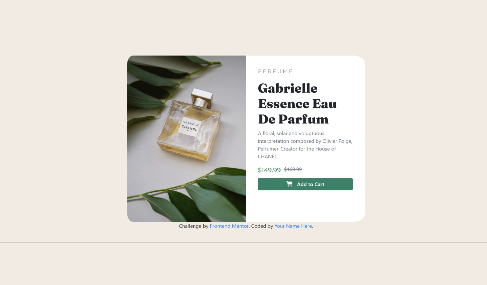

# Frontend Mentor - Product preview card component solution

This is a solution to the [Product preview card component challenge on Frontend Mentor](https://www.frontendmentor.io/challenges/product-preview-card-component-GO7UmttRfa). Frontend Mentor challenges help you improve your coding skills by building realistic projects. 

## Table of contents

- [Overview](#overview)
  - [The challenge](#the-challenge)
  - [Screenshot](#screenshot)
  - [Links](#links)
- [My process](#my-process)
  - [Built with](#built-with)
  - [What I learned](#what-i-learned)
  - [Continued development](#continued-development)
- [Author](#author)

**Note: Delete this note and update the table of contents based on what sections you keep.**

## Overview

### The challenge

Users should be able to:

- View the optimal layout depending on their device's screen size
- See hover and focus states for interactive elements

### Screenshot

### Links

- Solution URL: [Add solution URL here](https://github.com/Eya-ben-aziza/Product_preview_card_Frontend_Mentor.git)
- Live Site URL: [Add live site URL here](https://eya-ben-aziza.github.io/Product_preview_card_Frontend_Mentor/)

## My process

### Built with

- Semantic HTML5 markup
- CSS custom properties
- Flexbox
- Mobile-first workflow
- Bootstrap
- [Styled Components](https://cdnjs.cloudflare.com/ajax/libs/font-awesome/6.0.0-beta3/css/all.min.css) - For styles

**Note: These are just examples. Delete this note and replace the list above with your own choices**

### What I learned

I learned:
- mobile first approach
- media queries
- how to use external libraries 
- responsive images
- changing layouts when changing screen sizes

### Continued development

responsive images

## Author
- Frontend Mentor - [@Eya-ben-aziza](https://www.frontendmentor.io/profile/Eya-ben-aziza)

